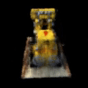

# NeRF-Applications

The best parameter combination is
* number of images in training set: 5
* dimension of the positional encoding: 10
* number of sampling: 64
* number of iterations: 2000

The following gif is generated using model trained with hyper parameters listed above.

